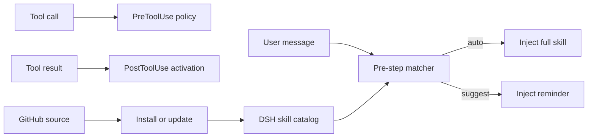

<div align="center">

# dsh-skills-manager

**Proactive skill activation, hook orchestration, and GitHub sync for DeepSeek Harness.**

**English** · [简体中文](./README.zh-CN.md)

[](./package.json)
[](https://github.com/Wisdoverse/dsh-skills-manager-plugin/actions/workflows/ci.yml)
[](./LICENSE)
[](https://nodejs.org/)
[](https://github.com/Wisdoverse/dsh-skills-manager-plugin/commits/main)
[](https://github.com/Wisdoverse/dsh-skills-manager-plugin/stargazers)

</div>

> Turn passive `SKILL.md` files into event-driven, GitHub-managed capabilities that activate when they are actually useful.

DSH already exposes the lifecycle hooks. This plugin connects those hooks to skill declarations, adds proactive matching, and provides a complete install/update/settings workflow—without changing DSH core.

## Table of contents

- [Why this plugin](#why-this-plugin)
- [Highlights](#highlights)
- [How it works](#how-it-works)
- [Quick start](#quick-start)
- [Compatibility](#compatibility)
- [Skill configuration](#skill-configuration)
- [Hook compatibility](#hook-compatibility)
- [GitHub-managed skills](#github-managed-skills)
- [Project-scoped skills](#project-scoped-skills)
- [Management and observability](#management-and-observability)
- [Permissions and data](#permissions-and-data)
- [Security](#security)
- [Development](#development)

## Why this plugin

The built-in DSH `skill` tool relies on the model to notice a short summary and decide to load the full skill. In practice, useful skills are often missed, skill files cannot directly declare lifecycle behavior, and locally scattered skills are difficult to keep synchronized.

`dsh-skills-manager` closes those gaps:

- matches every user turn against available skills;
- loads strong matches automatically and suggests weaker matches;
- maps Claude Code-style hook declarations onto DSH host events;
- manages skill sources from GitHub;
- keeps user and project overrides isolated;
- exposes controls in Settings and through the `skill_manager` model tool.

## Highlights

| | Capability | What it provides |
| --- | --- | --- |
| 🚀 | Proactive activation | Full skill injection for strong matches and lightweight reminders for suggestions |
| 🪝 | Skill-level hooks | `UserPromptSubmit`, `PreToolUse`, `PostToolUse`, `PostToolUseFailure`, and `SessionStart` |
| 🔄 | GitHub lifecycle | Install, update, authoritative sync, uninstall, and commit-change reporting |
| 🧭 | Workspace-aware scope | Project skills override user skills without leaking configuration between workspaces |
| 🛠️ | Built-in management | Settings UI plus the `skill_manager` model tool |
| 🛡️ | Guardrails | Source allowlisting, argument-array Git execution, hook path validation, and no shell execution for hooks |

## How it works



Before each agent step, the plugin scores available skills:

1. explicit skill-name mention: **+12**;
2. trigger phrase or regular expression: **+7**;
3. description or `whenToUse` token overlap: **+4 to +6**.

By default, a turn can auto-load up to two skills and suggest up to three. Activation markers are stored in conversation history, so full skill content is not injected repeatedly while it remains visible. After context compaction removes a marker, the skill can be loaded again automatically.

## Quick start

### Requirements

- DeepSeek Harness `0.1.1-rc.2`;
- Node.js `^22.19.0 || >=24.0.0`;
- pnpm available on `PATH` for `dsh plugin`.

### Install from GitHub

```sh
dsh plugin --profile web add github:Wisdoverse/dsh-skills-manager-plugin
```

DSH recognizes the package's `dsh.bundle` manifest and adds `dsh-skills-manager` to the Web profile automatically. Restart a running Web profile after installation.

### Update or remove

```sh
dsh plugin --profile web update dsh-skills-manager
dsh plugin --profile web remove dsh-skills-manager
```

Restart the profile after either operation so its composition matches the installed bundle set.

### Install a local checkout for development

```sh
git clone https://github.com/Wisdoverse/dsh-skills-manager-plugin.git
cd dsh-skills-manager-plugin
pnpm install --frozen-lockfile
dsh plugin --profile web add .
```

The included `cordis.patch.yml` inserts `skill-manager` into the host composition for all sessions.

## Compatibility

| Component | Supported or continuously verified |
| --- | --- |
| DeepSeek Harness | `0.1.1-rc.2` dependency contract and isolated GitHub-install smoke test |
| Node.js | `22.19.0` and `24.19.0` |
| pnpm | `11.19.0` with a frozen lockfile |
| Operating systems | Ubuntu and Windows CI matrix |

DSH is in developer preview. Pin the plugin to a commit when reproducibility matters, and re-run the install smoke test when upgrading DSH dependencies.

## Skill configuration

Declare activation and hooks directly in SKILL.md frontmatter:

```yaml
---
name: repo-hardening
description: Review and harden a repository with build/test gates.
metadata:
  activation: auto             # auto | suggest | off
  triggers:
    - "harden"
    - "build fails"
    - "re:exit code \\d+"
  hooks:
    UserPromptSubmit:
      inject: "Run build and tests before reaching a conclusion."
    PreToolUse:
      - tool: bash
        when: "git push"       # substring or re:<pattern>
        decision: deny         # allow | deny | ask
        reason: "Direct pushes are not allowed"
    PostToolUse:
      - tool: bash
        when: "re:exit code [1-9]"
        action: activate
    SessionStart:
      activate: true
---
```

### Activation modes

| Mode | Behavior |
| --- | --- |
| `auto` | A match injects the complete skill immediately |
| `suggest` | A match adds a lightweight reminder so the model can load the skill |
| `off` | The skill never participates automatically but remains manually invocable |

Codex-style `manual` and `disabled` values are accepted as aliases for `off`. If `activation` is omitted, skills with explicit triggers default to `auto`; all others default to `suggest`.

### Triggers and policies

- Plain trigger strings use case-insensitive substring matching.
- Values prefixed with `re:` are treated as regular expressions; invalid expressions are ignored.
- `PreToolUse.tool` accepts a concrete tool name or `*`.
- Tool policies return `allow`, `deny`, or `ask` with an optional reason.
- User overrides can be stored outside upstream SKILL.md files so updates do not erase local policy.

Example overrides:

```text
skill_manager set-triggers ponytail-review triggers=["review this diff","over-engineering"]
skill_manager set-hooks repo-hardening hooks={"PostToolUse":[{"tool":"bash","when":"re:exit code [1-9]","action":"activate"}]}
```

## Hook compatibility

| Skill hook | DSH host event | Support |
| --- | --- | --- |
| `UserPromptSubmit` | `agent/pre-step` | ✅ Inject text on every submission while active |
| `PreToolUse` | `tools/pre-execute` | ✅ Allow, deny, or ask based on tool and arguments |
| `PostToolUse` | `tools/post-execute` | ✅ Activate a skill from matching tool output |
| `PostToolUseFailure` | `tools/post-execute` | ✅ Match failure text through the same result event |
| `SessionStart` | `agent/session-start` | ✅ Activate before matching is required |
| `SessionEnd` / `Stop` | `agent/disposed` / `agent/turn-stopping` | ⚠️ Observable only; no content injection |
| `PreCompact` | No DSH core equivalent | ⚠️ Not implemented; removed activation markers allow reinjection |

## GitHub-managed skills

The manager accepts `owner/repo` shorthand and full `https://`, `git@`, or `ssh://` Git URLs.

```text
skill_manager install owner/repo
skill_manager update
skill_manager status
skill_manager uninstall skill-name
```

During installation, the plugin:

1. shallow-clones one branch into `<DSH_HOME>/skill-sources/<slug>`;
2. discovers SKILL.md directories up to depth 3;
3. ignores `.git`, `node_modules`, `dist`, and `build`;
4. copies discovered skills into `<DSH_HOME>/skills/<name>`.

Updates fetch the configured ref, reset the source to `FETCH_HEAD`, and perform an authoritative resync of installed skills. Filesystem watchers then invalidate the catalog automatically and emit `skills/change`.

Plugin manifests are detected in this order:

1. `.codex-plugin/plugin.json`;
2. `.claude-plugin/plugin.json`.

The Settings page displays the plugin name, version, skills, and hook count. Safe in-repository Node lifecycle hooks are supported for `SessionStart` and `UserPromptSubmit`.

State is stored in `<DSH_HOME>/skill-manager.json`, including sources, refs, commits, installed paths, scoped overrides, and the 50 most recent operations.

## Project-scoped skills

The filesystem provider resolves skill roots in priority order:

| Priority | Root | Source |
| --- | --- | --- |
| 1 | `<project>/.dsh/skills` | `project-dsh` |
| 2 | `<project>/.agents/skills` | `project-agents` |
| 3 | Host-configured directory | `custom` |
| 4 | `<DSH_HOME>/skills` | `user-dsh` |
| 5 | `<agentsHome>/skills` | `user-agents` |
| 6 | Bundled skills | `bundled` |

Project skills participate in the same matching pipeline and win same-name conflicts by priority. Mode, trigger, and hook overrides are keyed by `scope` plus `cwd`, preventing settings from leaking across projects or into user-level skills.

Project-local skills remain owned by the project's Git repository. The manager's `update` operation synchronizes user-level sources only; filesystem watchers refresh project changes.

## Management and observability

### Settings UI

Settings → **Skill Management** provides:

- a master switch for proactive activation;
- per-turn auto-load limits;
- GitHub install and update controls;
- per-skill mode, trigger, hook, source, and commit details;
- project workspace selection;
- uninstall actions and recent operation history.

### Model tool

The `skill_manager` tool supports `status`, `install`, `update`, `uninstall`, `set-mode`, `set-triggers`, `set-hooks`, and `set-config`. Project records use `scope: project` plus a required `cwd`.

### Events

- `skill-manager/hook` — `{ event, skill, action, detail, at }` for hook activity.
- `skill-manager/update` — synchronization results after install, update, or uninstall.
- `skills/change` — emitted by the filesystem provider after catalog changes.

## Permissions and data

| Surface | Behavior |
| --- | --- |
| Filesystem reads | Reads DSH user and project skill roots selected by the host, plus metadata from configured Git sources |
| Filesystem writes | Stores sources under `<DSH_HOME>/skill-sources`, manager-owned skills under `<DSH_HOME>/skills`, and state in `<DSH_HOME>/skill-manager.json` |
| Network | Invokes the local `git` executable only for user-requested source installation or update; the plugin implements no telemetry |
| Processes | Runs `git` with argument arrays and may run explicitly declared in-repository Node lifecycle hooks with time and output limits |
| Credentials | Does not store Git credentials; authentication remains owned by the user's Git configuration and credential helper |
| Conversation context | Reads the active prompt and skill catalog for matching, then injects activation or suggestion messages into the current session |

Uninstalling a manager-owned skill removes its copied skill directory. Locally authored skills that have no managed Git source are not removed by the manager.

## Security

- Git sources must match the supported URL allowlist.
- Git arguments are passed as arrays, not interpolated shell commands.
- Skill hooks do not run through a shell.
- Manifest hook paths must resolve to Node scripts inside the cloned repository.
- Malformed regular expressions and unsupported hook declarations are ignored.

Installing a plugin with executable hooks means trusting that repository's code. Review third-party sources before installation.

See [SECURITY.md](./SECURITY.md) for supported versions and private vulnerability reporting.

## Development

```sh
pnpm test
pnpm lint
```

| File | Responsibility |
| --- | --- |
| `lib.js` | Pure matching, scoring, state, hook, and manifest logic |
| `index.js` | DSH events, tools, RPC, Git operations, and integration wiring |
| `client/client.js` | Settings UI |
| `test.mjs` | Node test suite |
| `cordis.patch.yml` | Host composition patch |

Issues and pull requests are welcome in the [GitHub repository](https://github.com/Wisdoverse/dsh-skills-manager-plugin).

## License

Released under the [MIT License](./LICENSE).
