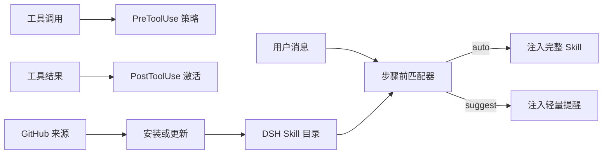

<div align="center">

# dsh-skills-manager

**面向 DeepSeek Harness 的主动 Skill 激活、Hook 编排与 GitHub 同步插件。**

[English](./README.md) · **简体中文**

[](./package.json)
[](./LICENSE)
[](https://nodejs.org/)
[](https://github.com/Wisdoverse/dsh-skills-manager-plugin/commits/main)
[](https://github.com/Wisdoverse/dsh-skills-manager-plugin/stargazers)

</div>

> 把被动的 `SKILL.md` 变成事件驱动、可由 GitHub 管理的能力，并在真正需要时自动激活。

DSH 已经提供完整的生命周期 Hook。本插件将这些 Hook 与 Skill 声明连接起来，同时补充主动匹配、GitHub 安装更新和 Settings 管理能力，无需修改 DSH 核心。

## 目录

- [为什么需要这个插件](#为什么需要这个插件)
- [核心特性](#核心特性)
- [工作原理](#工作原理)
- [快速开始](#快速开始)
- [Skill 配置](#skill-配置)
- [Hook 兼容性](#hook-兼容性)
- [GitHub 托管的 Skills](#github-托管的-skills)
- [项目级 Skills](#项目级-skills)
- [管理与可观测性](#管理与可观测性)
- [安全](#安全)
- [开发](#开发)

## 为什么需要这个插件

DSH 内置的 `skill` 工具依赖模型先注意到一段简短摘要，再自行决定是否加载完整 Skill。实际使用中，模型经常错过有价值的 Skill；Skill 文件无法直接声明生命周期行为；散落在本地的 Skill 也很难持续同步。

`dsh-skills-manager` 补齐了这些能力：

- 每轮请求都主动匹配可用 Skill；
- 强匹配自动加载，弱匹配轻量提醒；
- 将 Claude Code 风格的 Hook 声明映射到 DSH 宿主事件；
- 从 GitHub 安装、更新和卸载 Skill；
- 隔离用户级与项目级覆盖配置；
- 同时提供 Settings 界面和 `skill_manager` 模型工具。

## 核心特性

| | 能力 | 说明 |
| --- | --- | --- |
| 🚀 | 主动激活 | 强匹配注入完整 Skill，建议匹配只注入轻量提醒 |
| 🪝 | Skill 级 Hook | 支持 `UserPromptSubmit`、`PreToolUse`、`PostToolUse`、`PostToolUseFailure` 和 `SessionStart` |
| 🔄 | GitHub 生命周期 | 安装、更新、权威同步、卸载和 commit 变更报告 |
| 🧭 | Workspace 作用域 | 项目 Skill 可覆盖用户 Skill，同时避免配置跨 workspace 泄漏 |
| 🛠️ | 内置管理 | Settings 管理界面与 `skill_manager` 模型工具 |
| 🛡️ | 安全护栏 | 来源白名单、Git 参数数组、Hook 路径校验，Hook 不经过 shell |

## 工作原理



每个 Agent 步骤开始前，插件都会为可用 Skill 打分：

1. 明确提及 Skill 名称：**+12**；
2. 命中触发词或正则表达式：**+7**；
3. 描述或 `whenToUse` 词元重合：**+4 到 +6**。

默认每轮最多自动加载 2 个 Skill、建议 3 个。激活标记会写入会话历史；只要标记仍在可见上下文中，就不会重复注入完整内容。上下文压缩移除标记后，Skill 可以再次自动加载。

## 快速开始

### 1. 将插件链接到 DSH Web Profile

```sh
cd /data/dsh/profiles/web
pnpm add link:/data/dsh/home/dsh-skills-manager
```

### 2. 启用 Bundle

在 Profile 的 `package.json` 中，把 `dsh-skills-manager` 加入 `dsh.profile.bundles`：

```json
{
  "dsh": {
    "profile": {
      "bundles": ["dsh-skills-manager"]
    }
  }
}
```

### 3. 重启 Profile

重启后宿主侧插件生效，客户端 Bundle 会自动重建。插件自带的 `cordis.patch.yml` 会把 `skill-manager` 插入宿主 composition，对所有会话生效。

## Skill 配置

在 SKILL.md 的 frontmatter 中直接声明激活条件与 Hook：

```yaml
---
name: repo-hardening
description: Review and harden a repository with build/test gates.
metadata:
  activation: auto             # auto | suggest | off
  triggers:
    - "harden"
    - "build fails"
    - "re:exit code \\d+"
  hooks:
    UserPromptSubmit:
      inject: "得出结论前必须先运行 build 与 test。"
    PreToolUse:
      - tool: bash
        when: "git push"       # 子串或 re:<pattern>
        decision: deny         # allow | deny | ask
        reason: "不允许直接 push"
    PostToolUse:
      - tool: bash
        when: "re:exit code [1-9]"
        action: activate
    SessionStart:
      activate: true
---
```

### 激活模式

| 模式 | 行为 |
| --- | --- |
| `auto` | 命中后立即注入完整 Skill |
| `suggest` | 命中后添加轻量提醒，由模型决定是否加载 |
| `off` | 不参与自动匹配，但模型仍可手动调用 |

Codex 风格的 `manual` 与 `disabled` 会作为 `off` 的别名处理。如果没有声明 `activation`，带显式 triggers 的 Skill 默认为 `auto`，其他 Skill 默认为 `suggest`。

### 触发词与策略

- 普通触发词执行大小写不敏感的子串匹配。
- `re:` 前缀表示正则表达式；无效正则会被忽略。
- `PreToolUse.tool` 可以填写具体工具名或 `*`。
- 工具策略返回 `allow`、`deny` 或 `ask`，并可附带原因。
- 用户覆盖配置可以存储在上游 SKILL.md 之外，避免更新时丢失本地策略。

覆盖配置示例：

```text
skill_manager set-triggers ponytail-review triggers=["review this diff","过度设计"]
skill_manager set-hooks repo-hardening hooks={"PostToolUse":[{"tool":"bash","when":"re:exit code [1-9]","action":"activate"}]}
```

## Hook 兼容性

| Skill Hook | DSH 宿主事件 | 支持情况 |
| --- | --- | --- |
| `UserPromptSubmit` | `agent/pre-step` | ✅ 激活期间每轮注入声明文本 |
| `PreToolUse` | `tools/pre-execute` | ✅ 根据工具名与参数执行 allow、deny 或 ask |
| `PostToolUse` | `tools/post-execute` | ✅ 工具输出命中后激活 Skill |
| `PostToolUseFailure` | `tools/post-execute` | ✅ 通过同一结果事件匹配失败文本 |
| `SessionStart` | `agent/session-start` | ✅ 无需匹配即可在会话开始时激活 |
| `SessionEnd` / `Stop` | `agent/disposed` / `agent/turn-stopping` | ⚠️ 仅可观察，不注入内容 |
| `PreCompact` | DSH 核心无对应事件 | ⚠️ 未实现；压缩移除激活标记后可重新注入 |

## GitHub 托管的 Skills

管理器接受 `owner/repo` 简写，以及完整的 `https://`、`git@` 或 `ssh://` Git URL。

```text
skill_manager install owner/repo
skill_manager update
skill_manager status
skill_manager uninstall skill-name
```

安装过程中，插件会：

1. 将单一分支浅克隆到 `<DSH_HOME>/skill-sources/<slug>`；
2. 在最多 3 层目录中发现包含 SKILL.md 的目录；
3. 跳过 `.git`、`node_modules`、`dist` 和 `build`；
4. 把发现的 Skill 复制到 `<DSH_HOME>/skills/<name>`。

更新时会拉取配置的 ref，把来源重置到 `FETCH_HEAD`，再对已安装 Skill 执行权威同步。随后文件监视器自动使目录缓存失效并派发 `skills/change`。

插件 Manifest 按以下顺序检测：

1. `.codex-plugin/plugin.json`；
2. `.claude-plugin/plugin.json`。

Settings 页面会展示插件名称、版本、Skills 和 Hook 数量。Manifest 中指向仓库内部 Node 脚本的安全生命周期 Hook，可用于 `SessionStart` 与 `UserPromptSubmit`。

状态保存在 `<DSH_HOME>/skill-manager.json`，包括来源、ref、commit、安装路径、作用域覆盖和最近 50 条操作记录。

## 项目级 Skills

Filesystem Provider 按以下优先级解析 Skill 根目录：

| 优先级 | 根目录 | Source |
| --- | --- | --- |
| 1 | `<project>/.dsh/skills` | `project-dsh` |
| 2 | `<project>/.agents/skills` | `project-agents` |
| 3 | 宿主配置的目录 | `custom` |
| 4 | `<DSH_HOME>/skills` | `user-dsh` |
| 5 | `<agentsHome>/skills` | `user-agents` |
| 6 | 内置 Skills | `bundled` |

项目 Skill 使用同一套匹配流程，并凭优先级在同名冲突中胜出。模式、触发词与 Hook 覆盖按 `scope` 和 `cwd` 存储，避免设置跨项目或泄漏到用户级 Skill。

项目内 Skill 仍由项目自己的 Git 仓库管理。管理器的 `update` 只同步用户级来源；项目改动由文件监视器自动刷新。

## 管理与可观测性

### Settings 界面

Settings → **Skill 管理** 提供：

- 主动激活总开关；
- 每轮自动加载数量限制；
- GitHub 安装与更新操作；
- 每个 Skill 的模式、触发词、Hook、来源与 commit 信息；
- 项目 workspace 选择；
- 卸载操作与最近历史。

### 模型工具

`skill_manager` 支持 `status`、`install`、`update`、`uninstall`、`set-mode`、`set-triggers`、`set-hooks` 与 `set-config`。项目记录使用 `scope: project`，并且必须提供 `cwd`。

### 事件

- `skill-manager/hook` — `{ event, skill, action, detail, at }`，记录 Hook 活动。
- `skill-manager/update` — 安装、更新或卸载后的同步结果。
- `skills/change` — Skill 目录变化后由 Filesystem Provider 派发。

## 安全

- Git 来源必须匹配受支持的 URL 白名单。
- Git 参数以数组传递，不拼接为 shell 命令。
- Skill Hook 不经过 shell 执行。
- Manifest Hook 路径必须解析到克隆仓库内部的 Node 脚本。
- 无效正则和不受支持的 Hook 声明会被忽略。

安装带有可执行 Hook 的插件，意味着信任该仓库的代码。安装第三方来源前请先进行审查。

## 开发

```sh
pnpm test
pnpm lint
```

| 文件 | 职责 |
| --- | --- |
| `lib.js` | 纯函数：匹配、打分、状态、Hook 与 Manifest 处理 |
| `index.js` | DSH 事件、工具、RPC、Git 操作与集成接线 |
| `client/client.js` | Settings 管理界面 |
| `test.mjs` | Node 测试套件 |
| `cordis.patch.yml` | 宿主 composition 补丁 |

欢迎在 [GitHub 仓库](https://github.com/Wisdoverse/dsh-skills-manager-plugin)提交 Issue 或 Pull Request。

## License

本项目基于 [MIT License](./LICENSE) 发布。
